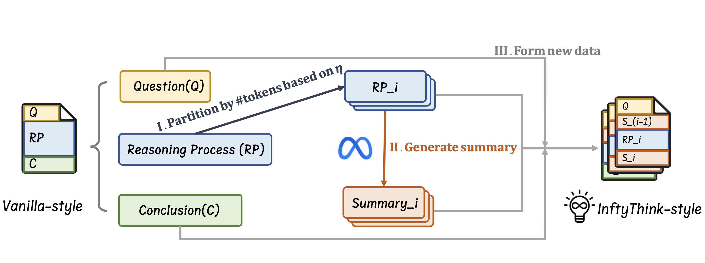

<div align="center">
     <h1>InftyThink:  Breaking the Length Limits of Long-Context Reasoning in Large Language Models</h2>
</div>

<p align="center">
  <strong>Yuchen Yan<sup>1,2,*</sup></strong>,  
  <strong>Yongliang Shen<sup>1,†</sup></strong>,  
  Yang Liu <sup>2</sup>, 
  Jin Jiang <sup>2,3</sup>, 
  <br>
  Mengdi zhang <sup>2</sup>, 
  <strong>Jian Shao<sup>1,†</sup></strong>,  
  Yueting Zhuang<sup>1</sup>
</p>
<p align="center">
  <sup>1</sup>Zhejiang University  
  <sup>2</sup>Meituan Group
  <sup>3</sup>Peking university
  <br>
  <em>Preprint. Under review.</em>  
  <br>
  <sup>*</sup>Contribution during internship at Meituan Group, <sup>†</sup>Corresponding Author
</p>


<p align="center">
🤗 <a href="https://huggingface.co/datasets/ZJU-REAL/InftyThink">Dataset</a> |
 <a href="https://arxiv.org/abs/2503.06692">Arxiv</a> 
| 📑 <a href="https://zju-real.github.io/InftyThink/">WebPage</a> 
<br>
</p>

## News 🔥🔥
- **2025.07.12:** We release our re-implemented dataset.
- **2025.05.24:** We release our HomePage and Code examples.
- **2025.03.09:** We release our paper.

## Overview 🦾🦾


In this paper, we propose a fundamentally different approach to long-context reasoning. Rather than viewing reasoning as a single extended process, we introduce InftyThink, a novel paradigm that divides complex reasoning into multiple interrelated short reasoning segments. Each segment remains within a computationally efficient context length while maintaining the coherent flow of thought across iterations. This approach draws inspiration from human cognitive processes, where complex problem-solving frequently involves breaking problems into manageable parts and summarizing intermediate progress.

Our contributions can be summarized as follows:  
-  We introduce InftyThink, which transforms monolithic long-form reasoning into iterative reasoning with summarization, mimicking human working memory patterns and reducing the quadratic computational complexity of transformer-based models to a more manageable form.
- We develop a technique to reconstruct existing long-context reasoning datasets (demonstrated on OpenR1-Math) into our iterative format, preserving reasoning quality while enabling more efficient computation without specialized architectures.
- Across multiple model architectures, our approach achieves significant improvements while substantially reducing computational costs, challenging the assumed trade-off between reasoning depth and efficiency.

## QuickStart 🎯🎯
```plaintext
InftyThink
├── data_preprocess  # Generate InftyThink-style data
├── inference        # An example for using InftyThink-style models
├── docs
└── readme.md
```

## Generate InftyThink-style Data



### Step 1: Thinking process segmentation
```sh
cd data_preprocess
python3 segmentation.py --dataset_name open-r1/OpenR1-Math-220k \
    --tokenizer Qwen/Qwen2.5-Math-7B \
    --eta 4096
```

### Step 2: Generate summary and form InftyThink-style data
```sh
cd data_preprocess
python3 generate_data.py --model meta-llama/Llama-3.3-70B-Instruct
```
After code finished, InftyThink-style data is available.

## Inference
We provide an example for InftyThink-style reasoning, after your SFT on InftyThink-style data, feel free to try it!
```sh
cd inference
python3 infer_single.py
```

## Citation

If you find our work helpful, feel free to give us a cite.

```
@misc{yan2025inftythink,
    title={InftyThink: Breaking the Length Limits of Long-Context Reasoning in Large Language Models}, 
    author={Yuchen Yan and Yongliang Shen and Yang Liu and Jin Jiang and Mengdi Zhang and Jian Shao and Yueting Zhuang},
    year={2025},
    eprint={2503.06692},
    archivePrefix={arXiv},
    primaryClass={cs.CL},
    url={https://arxiv.org/abs/2503.06692}, 
}
```

## Contact Us
If you have any questions, please contact us by email: 
yanyuchen@zju.edu.cn
